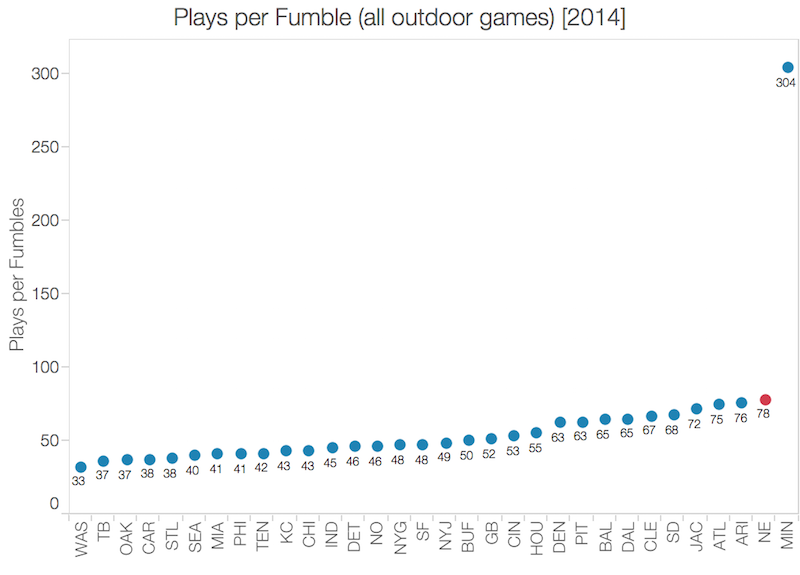
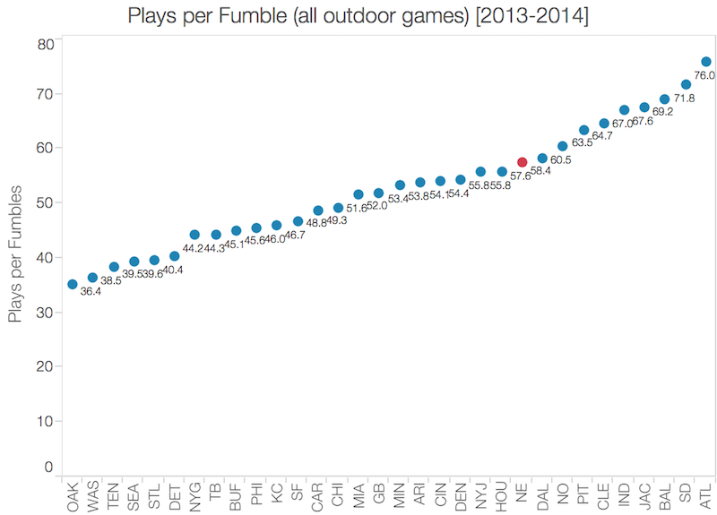
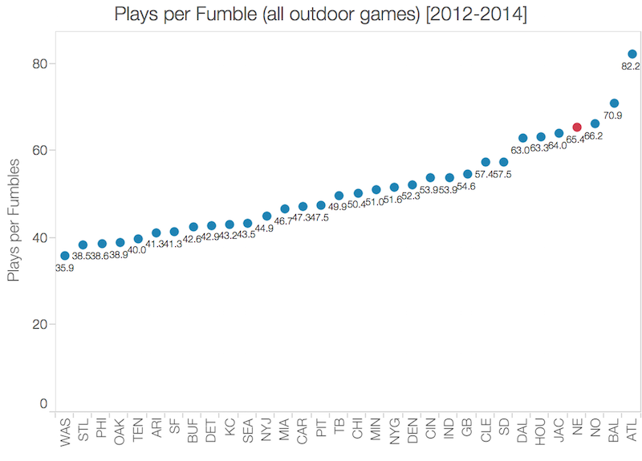
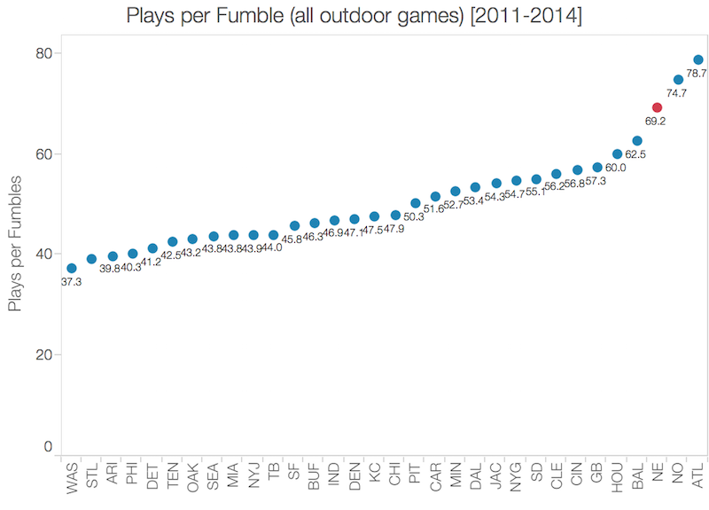

Title: Comments on Warren Sharp's Patriots Fumble Analysis
Slug: fumbles
Date: 2015-01-27
Status: published
Image: fumbles/img/og.png
Banner: #111
Imports: []
Summary: There's been a story going around that the Patriots illegally deflate their footballs, and this has the effect of making them superhuman at ball security. The statistical analyses used to show this outlying fumble rate are flawed. Here's why.

First, an admission. I am a life-long [New England Patriots](http://www.patriots.com) fan. You could probably assume that because there is no other reason I would put the time into this analysis that I have. On the other hand, I definitely value good statistical analyses leading to well-founded conclusions that elucidate difficult concepts for people instead of adding more confusion. And the confusion and jumping-to-conclusions-with-no-actual-information with this entire Deflategate mess (PSI: New England is the far superior name) is something that doesn't need a thorough statistical analysis pointing people in the wrong direction. But this is what has happened. People claim "numbers don't lie" as an end-all to arguments and point to (among others on his blog) [Warren Sharp's very detailed analysis of Patriot fumble rates](http://www.sharpfootballanalysis.com/blog/2015/the-new-england-patriots-prevention-of-fumbles-is-nearly-impossible). Well, I can assure you: numbers are very easy to manipulate.

### Summary

I claim that not only are the New England Patriots _not_ an impossible outlier in fumble efficiency, they're not an outlier at all. I can show this simply by exactly recreating Sharp's analysis but correcting for merely _one_ omission from the data set: instead of eliminating _all_ dome teams from the sample set, only remove games _played_ indoors. I will also highlight the choice of what I believe to be a biased an unfair comparison metric (the 5-year rolling average in plays per fumble), the use of which still only looks like damning evidence if dome teams are removed from the analysis. I will also attempt to calculate the _actual_ probability of the Patriots having this current run of success in fumble efficiency, although admittedly my calculation is not perfect. It's a physicist's approximation. Finally, I will argue that while the Patriots _did_ drastically improve in fumble efficiency in 2007 and following, without the prior assumption of guilt in cheating, there are numerable other explanations for this team to improve.

Also, an apology off the bat: I don't know Warren Sharp. I don't know his motivation behind this analysis. And, maybe I'm being a bit too defensive of my football team (I'm certainly _not_ going to say that they're innocent yet, although I have theories -- more on that in a later post). But, I have very real concerns with the large number of assumptions and convenient omissions from his analysis that make me feel compelled to issue commentary. This analysis has gone extremely viral (an honestly non-sarcastic kudos to you, Warren!) with no one seriously questioning it. Take this for what it's worth. I mean no offense, Warren, and I welcome your response.

### Update: Other Fantastic Articles in This Space

There has been a lot of chatter on this topic in the statisticians blogosphere. Some highlights below:

[FiveThirtyEight's summary of the fumble analysis hubbub, by Neil Paine](http://fivethirtyeight.com/datalab/your-guide-to-deflate-gateballghazi-related-statistical-analyses/) -- follow him [@Neil_Paine](https://twitter.com/Neil_Paine)

[SoSH Football Central's response to Sharp's analysis, specifically the fumble rates of specific players on Patriots vs. on other teams, by Daryl Sng](http://soshcentral.com/football-science/football-statistics/2015/01/27/fumbling-data-truth-patriots-fumble-rate/) -- follow him [@singaporesoxfan](https://twitter.com/singaporesoxfan)

[Deadspin Regressing's article, which is a point-by-point counter to Sharp's analysis, by Gregory J. Matthews and Michael Lopez](http://regressing.deadspin.com/why-those-statistics-about-the-patriots-fumbles-are-mos-1681805710) -- follow Michael [@StatsbyLopez](https://twitter.com/StatsbyLopez) and Gregory [@StatsInTheWild](https://twitter.com/StatsInTheWild)

[ShoutingLoudly's look at the statistical significance of the player-by-player fumble rate while on Patriots vs. on other teams, by Bill Herman](http://www.shoutingloudly.com/2015/01/27/deflategate/) -- follow him [@shoutingloudly](https://twitter.com/shoutingloudly)

[My friend Tom Hayden's take on the normality assumption used in calculating the likelihood](http://tomhayden3.com/2015/01/24/patriots/) -- follow him [@haydenth](https://twitter.com/haydenth)

### Data Set Description

My friend and former [GrubHub](http://www.grubhub.com) colleague [Tom Hayden](http://tomhayden3.com) shared with me a database of season-by-season, team-by-team fumble and play count data scraped from [NFL.com](http://www.nfl.com), grouped not only by team and season, but also by games played indoors, outdoors, and in a retractable roof stadium. I am considering _total_ fumbles in this analysis, not fumbles _lost_, because a) I want more data to lead to better accuracy and b) I simply refuse to believe that fumble recovery rates (analagous to a coin flip) are affected for one team over another because of a 10% psi difference. For simplicity (and for obvious reasons), I'm going to be considering only games that are played outdoors. This is something Warren Sharp attempts, but for some reason chooses the route of throwing out _all_ games played by dome teams, not just ones indoors. The data can be found [here](data/nfl_fumbles.csv).

### Analysis

And now, for the analysis.

#### Challenged Assumption #1: Don't throw out dome teams

You can throw out games played indoors, I am fine with that. It makes a ton of sense (although something interesting I found: fumble rates were actually _higher_ indoors than outdoors -- go figure!). But please, the extra work _must_ be done to preserve the games played by dome teams outdoors. I cannot stress this enough: __there is no reason to remove dome teams from this analysis, there is only reason to remove games played indoors.__ There are a few reasons:

1. It makes no sense to (e.g.) include a game played between the Falcons and Patriots in New England (outdoors) in the analysis for the Patriots but not include the exact same game for the Falcons. Throwing out all dome teams does exactly this.

2. Two of the greatest quarterbacks of this generation have played significant time as part of a dome team (Peyton Manning and Drew Brees). To take those offenses out of consideration and comparison with the Patriots is unfair.

3. It turns out that -- and I definitely don't know why -- teams that play in domes tend to have fantastic fumble stats when playing outdoors. Eliminating these from the data set obviously makes the Patriots look really, really bad because you just eliminated most of their real competition for fumble efficiency, whether intentionally or not.

#### Challenged Assumption #2: Don't cherry pick a 5-year rolling average

I have no non-conspiracy theory idea why Warren Sharp decided to use the 5-year rolling average rate of plays per fumble instead of, say, a 2-year rolling average, or simply a year-by-year look. But I _can_ tell you this, the Patriots total league rank each year in plays per fumble (outdoors only) looks like this (apologies for not having 2001 in this set!):

| Season | Rate (plays / fumble) | Rank |
| ------ | --------------------- | ---- |
| 2014   | 78.3                  | 2nd  |
| 2013   | 46.8                  | 21st |
| 2012   | 85.1                  | 3rd  |
| 2011   | 83.2                  | 2nd  |
| 2010   | 103.7                 | 1st  |
| 2009   | 79.5                  | 2nd  |
| 2008   | 64.3                  | 5th  |
| 2007   | 71.1                  | 2nd  |
| 2006   | 41.4                  | 19th |
| 2005   | 51.2                  | 10th |
| 2004   | 42.1                  | 18th |
| 2003   | 46.8                  | 10th |
| 2002   | 40.1                  | 14th |

Okay, fine. One conspiracy theory: the 5-year rolling average was chosen because 1 year doesn't look bad (they were only 1st ONCE in the last 13 years!), you can't use a 2- or 3-year rolling average because that 2013 is going to bring your average way down (see below). And you might as well get that stellar 2010 season in there to make it look, as Warren Sharp would say, IMPOSSIBLE. If intentional, this is called cherry picking, and it's a huge no-no in the world of analysis. It's a way to make numbers lie.

What _I_ see is an incredibly good, incredibly consistent team. I don't see a _perfectly_ consistent team, because they _sucked_ last year (and no, you can't just say 2013 doesn't count because of the 6 fumble Broncos game because you would then need to remove _all_ bad games by _all_ teams before making a comparison -- play fair!). Also, I don't see a team that even necessarily stands out as being an outlier, let alone an impossible one.

Take a look at the actual data going into the 5-year rolling average calculation. In all seasons by all teams since 2010, the Patriots (while incredible good at not fumbling each year) have only accounted for 1 of the top 7 team-seasons in terms of plays per fumble. There is simply _no way_ you can make the claim that their ability to hold onto the football is impossible if you actually show a fair and transparent data set.



In Sharp's analysis, after removing all dome teams from the comparison set, and by choice of the 5-year rolling average in plays per fumble as the comparison metric, he comes up with the following, _incredible_ scandalous looking plot.



However, by reintroducing dome teams and only eliminating those games played indoors, the exact same plot looks like this:



And, just to highlight the absurdity of choosing a 5-year rolling average over _any_ other season spread containing the 2014 season:

<table style="width:100%">
    <tr>
        <td bgcolor="#fff"></td>
        <td bgcolor="#fff"></td>
    </tr>
    <tr>
        <td bgcolor="#fff"></td>
        <td bgcolor="#fff"></td>
    </tr>
</table>

An aside that I simply cannot resist: __what is the deal with the 2014 Minnesota Vikings!?__ If deflated footballs are the cause of all the success the Patriots have had in fumble efficiency since 2007, then why does the _one_ team that has been [caught tampering with footballs post-inspection](http://espn.go.com/blog/minnesota-vikings/post/_/id/11218/nfl-aware-of-game-ball-incident-during-panthers-vikings) stand out as such an impossible outlier this season, especially since they were caught _heating_ footballs, which would cause the ball to artificially _inflate_? And no, I don't really think the Vikings were cheating in warming up their footballs; and no, I don't really think the Vikings fumble efficiency success this season had anything to do with football air pressure.

What is clear in all this:

1. Even choosing the 5-year rolling average, the Patriots are not a statistical outlier, they are simply on the high end of excellence in the league. They're not even the best.

2. It's pretty clear that while the Patriots have been very consistent and therefore near the top of the league in this statistic for years, choosing _any_ other comparison set than the 5-year rolling average makes the Patriots look worse that what was portrayed in Sharp's analysis.

#### Challenged Assumption #3: Don't say this can only occur once in 16,233.77 instances

First of all, the data scientist quoted for this statistic says, "Based on the assumption that fumbles per play follow a normal distribution." Other than simply looking at the histogram above and realizing that this doesn't look altogether normal, I'm not going to go into why this is a faulty assumption. Besides, my friend [Tom has already made this point](http://tomhayden3.com/2015/01/24/patriots/) (even throwing out all dome teams!). Without this assumption, it is difficult to make precise calculations of the rarity of the Patriots success, even assuming everything that allows Warren Sharp to produce the extremely damning-looking data set above.

And another thing: the "once in 16,233.77 instances" statistic is assuming that fumbles occur "according to random fluctuation." This is not only an absurd assumption (player skill and offensive scheme definitely contribute), it's been [shown statistically that only about half of all turnovers (fumbles included) are due to luck and not skill/scheme](http://harvardsportsanalysis.org/2014/10/how-random-are-turnovers/).

As a quick exercise to come up with my own calculation in how likely this outcome is, I make the claim that in order for the Patriots to appear in the position they do in the 5-year rolling average of plays per fumble, all they need to do is finish in the Top 3 in the league in 4 out of the 5 seasons involved. If the odds of the Patriots finishing in the Top 3 any given season is a constant _a_, then the probability of finishing in the Top 3 in 4 out of 5 years is given by

$$p = a^5 + 5 a^4 (1 - a)$$

This comes from the fact that 5 out of 5 years is a success (with probability $a^5$) and 4 out of 5 years is a success (with probability $a^4 (1-a)$). The latter has 5 ways of happening: for example, the failed year could be 2014 or 2013 or 2012 or 2011 or 2010.

In a world where fumbles are _solely_ driven by random fluctation (a world we don't live in, but still), the Patriots will finish in the Top 3 with a probability $a = 3/32$. Plugging into the equation above, this results in an outcome _at least as successful_ as the Patriots outcome would occur only 0.04% of the time, or once in 2,800 instances.

On the other hand, assuming there's not some nefarious reason for the Patriots to appear this frequently in the Top 3 over the years, we actually _do_ have a sample that helps us understand the Patriots probability of appearing in the Top 3 in 4 of 5 years: their historical frequency of ranking in the Top 3. There are many season sample sizes I can choose to come up with the single-season probability _a_. Do I only include the current Patriots scheme, and thus only post-2007 data ($a = 6/8$)? Do I include _all_ data from the Brady/Belichick era since 2002 ($a = 6/13$)? Do I use either of these two numbers divided by 2, since luck plays a 50% role on average ($a = 6/16$ or $a = 6/26$)? Using each of these assumption in turn, I find that the probability of that Patriots having a similar or better stretch of success over a 5-year period is far from impossible.

| Single-Season Probability $a$ | Probability of 4 out of 5 having successful seasons $p = a^5 + 5 a^4 (1 - a)$ | Rate of Occurence $1/p$ |
| ----- | ------ | ------------------------- |
| 3/32  | 0.04%  | once in 2,800 instances   |
| 6/8   | 63.3%  | twice out of 3 instances  |
| 6/13  | 14.3%  | once in 7 instances       |
| 6/16  | 6.92%  | once in 14 instances      |
| 6/26  | 1.16%  | once in 86 instances      |

Again, these calculations are completely illustrative. They aren't the most precise, but they certainly help paint a picture. If you must assume that all fumbles are completely random and the Patriots are most likely to finish 16th next season once they can no longer "cheat," then I'll admit that it would be damn difficult to get a similar stretch of success (once in 2,800 instances). But if this team is simply good and exceptionally efficient in holding onto the football, then it's actually incredibly likely for this to have happened -- probable, in fact. Keep in mind that if once in 14 instances were the right frequency, then _two_ similarly talented teams would be _expected_ to perform this well in the league in any 5-year span.

#### Challenged Assumption #4: Don't assign scheme improvements to cheating

Now, let me return to the per-season plays per fumble numbers for the Patriots.

| Season | Rate (plays / fumble) | Rank |
| ------ | --------------------- | ---- |
| 2014   | 78.3                  | 2nd  |
| 2013   | 46.8                  | 21st |
| 2012   | 85.1                  | 3rd  |
| 2011   | 83.2                  | 2nd  |
| 2010   | 103.7                 | 1st  |
| 2009   | 79.5                  | 2nd  |
| 2008   | 64.3                  | 5th  |
| 2007   | 71.1                  | 2nd  |
| 2006   | 41.4                  | 19th |
| 2005   | 51.2                  | 10th |
| 2004   | 42.1                  | 18th |
| 2003   | 46.8                  | 10th |
| 2002   | 40.1                  | 14th |

Another glaringly obvious trend in this data is that, yes, the Patriots got _way_ better starting in 2007. If you want to assign this meaning because this was the year that the ball rule went into effect, go ahead. Conspiracy theories are hard to contest when there is an incredibly intertwined set of causes. Do lizard people secretly run our government? PROVE THAT THEY DON'T. Anyhow, might I also suggest the following plausible explanations for drastic improvement?

1. Consider 2006: Reche Caldwell, Doug Gabriel. Now consider 2007: Randy Moss, Wes Welker. Same in 2008. You eventually get Rob Gronkowski, Julian Edelman, et cetera. Please don't make me compare Reche, Ben Watson, and Troy Brown (LOVE YOU, TROY!) to Gronk and Welker.

2. The pre-2006 Patriots ran a _completely different offensive set_ than the post-2007 Patriots. Remember the 2007 Patriots? The greatest offense ever assembled? They were the first Patriots spread offense. They still use that today.

3. Tom Brady is simply better now. I remember watching Brady dink high passes off of receivers on crossing routes leading to tipped interceptions. I remember him being in the pocket _too_ long. I _now_ see him getting rid of the ball at nearly the fastest pace in the game. I see him intentionally throwing the ball at the feet of receivers in traffic and on crossing routes causing them to catch the pass on the way to the turf (thus not allowing fumbles on tackles).

4. And why were they much more pedestrian in 2008 while still having the greatest offensive skill players in the league? Could it have had something to do with Bernard Pollard and Matt Cassel?

Before jumping to conclusions that a ball that is underinflated by 10% at most can somehow _halve_ the rate of fumble occurence, I simply ask that you first consider the far more likely scenarios. Conspiracy theories are fun and incredibly hard to refute, but that doesn't make them the most plausible explanation.

### Conclusion

I hope that you've seen that not only are the Patriots not IMPOSSIBLE outliers in the rate of plays per fumble, but their observed success in this metric is actually expected by at least a couple of teams every season. In fact, the Patriots __don't even lead the league in the rate of plays per fumble__ by any metric I could find, assuming of course that you don't simply eliminate dome teams from the calculation (and only limit the calculation to games played outdoors).

In short, and I am very confident when I say this, __there has not been a single statistically accurate statement made that any underinflation of footballs by the New England Patriots has any impact on the game__. This does not mean that if they _did_ intentionally deflate footballs, in a way that is against the rules as stated, they should not be punished. This is simply my attempt to quell the rising insurgence of pitchfork-wielding Patriots-haters asking for Bill Belichick's firing and that they should not be allowed the play in the Superbowl.

Why don't we all give this absurd story a little time to breathe, allow a few confirmed facts to be established, and then go about the business of providing proof that the Patriots violated league rules. This team is not a team of cheaters, as far as I can tell. Numbers don't lie.
